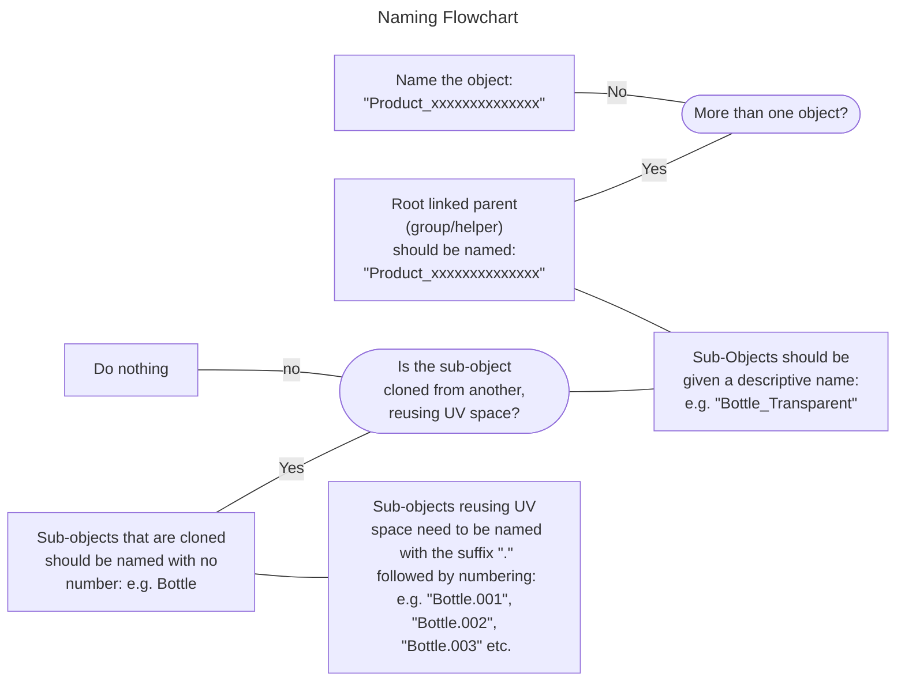

# Geometry
{: .no_toc }

## Table of contents
{: .no_toc .text-delta }

1. TOC
{:toc}

---

<iframe width="560" height="315" src="https://www.youtube.com/embed/tvaRgmhT-wU" title="YouTube video player" frameborder="0" allow="accelerometer; autoplay; clipboard-write; encrypted-media; gyroscope; picture-in-picture; web-share" allowfullscreen></iframe>{: .center-image }

---

## Object Naming Convention	

### Naming assets with a single object:

> A single object must be named with the prefix "**Product_**", followed by the products `UPC`.  

{: .center-image }

Name used on asset with only one object.
{: .figure }

---

### Naming assets with more than one object:

The linked parent group/helper must be named with the prefix of "**Product_**", followed by the products `UPC`.  

{: .center-image }

Example of a product with more than one object.
{: .figure }

> Assets with More than one object must be grouped/linked to a helper. Click [here]( /wiki/Product-Specification/Geometry/#geometry) for more details.
{: .note}

> ---

### Naming examples
 

| Object type | Object Naming Example                    |
|:---|:-----------------------------|
|Root parent object (**or single existing object**)|**Product_**888750194923   |
|Sub-object - **Source of Duplication**|YoghurtPot |
|sub-Object - **Duplicate (reusing UVs)**| YoghurtPot**.001**, YoghurtPot**.002** etc...|

If sub-objects are present, they must always have a unique name. Make sure only to append the suffix with a dot "." (e.g. "Bottle.001") if the sub-object in question is reusing UV space from another object in the scene.

> Objects named with the suffix **".001"**, **".002"** etc are ignored in the baking process after model upload. If correct naming isn't used, your model may fail QA.
{: .warning }

 

---

## Object Hierarchy
 

---

## Object Transform
 

---

## Dimensions
 

All product models must conform to

> dsdsd
{ .note }

---

## Mesh
 
